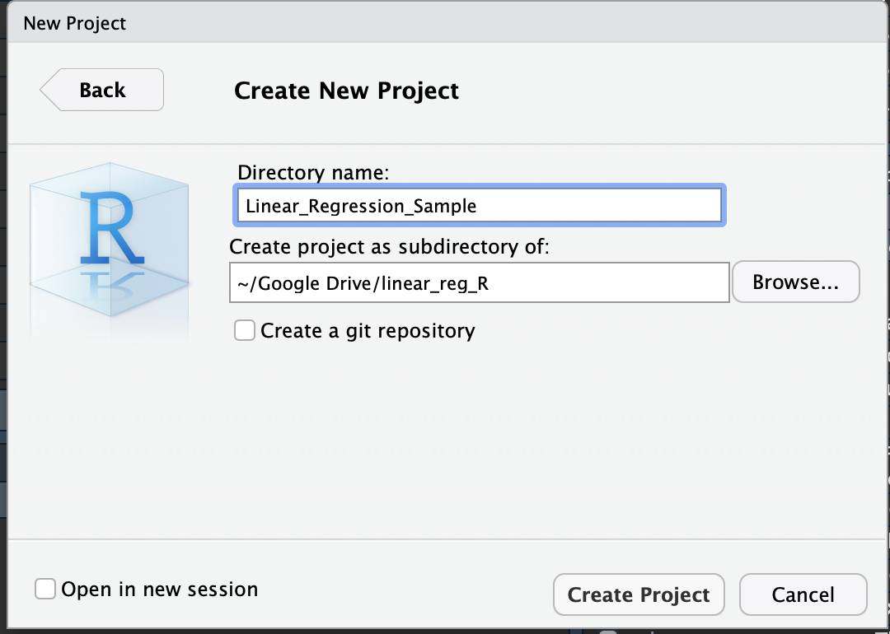
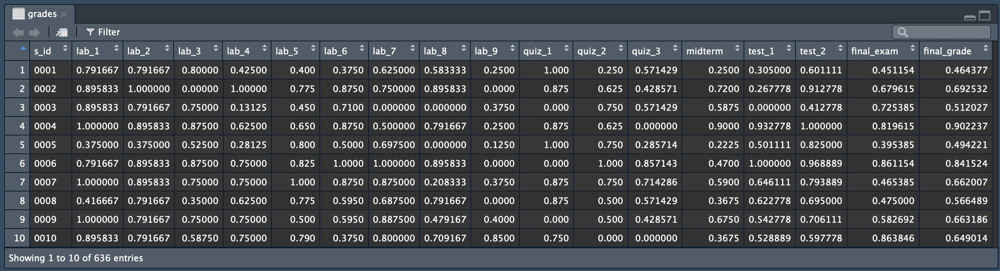
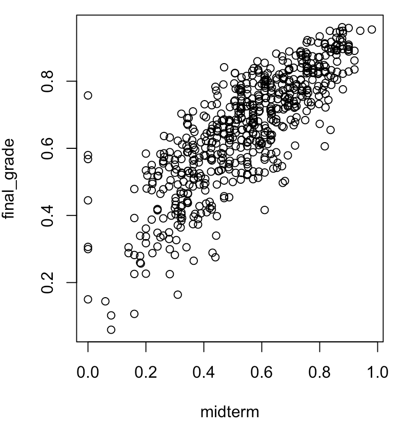
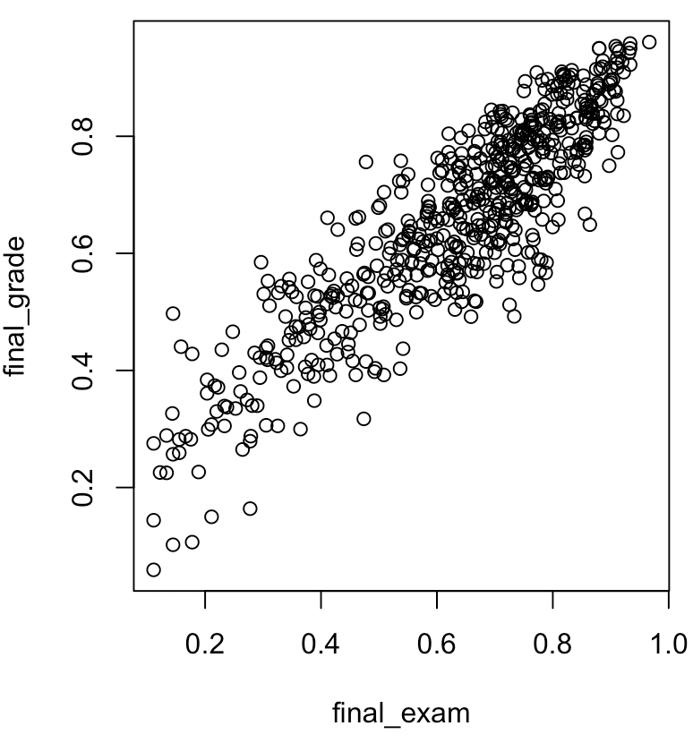
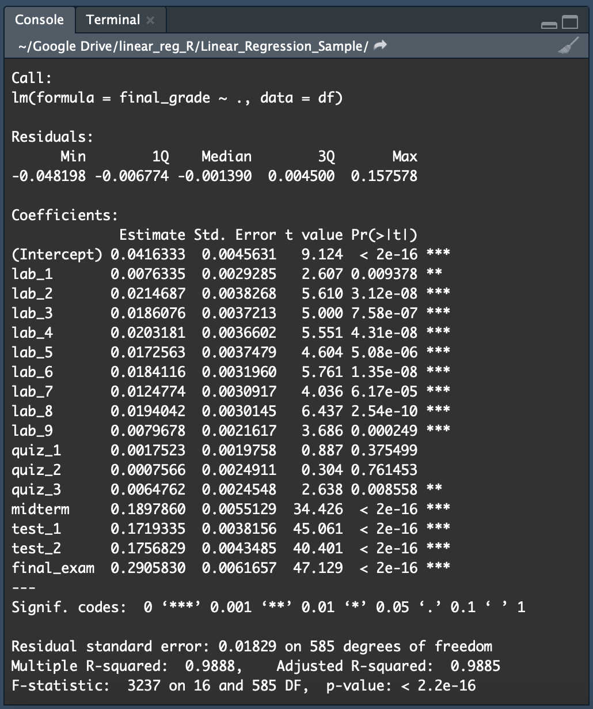

# GradeWeightSolver
A short tutorial of performing Linear Regression in R by determining the weights of grade requirements of students towards the overall grade

## The Scenario
I have thought of beginning a series, writing blogs for my <a href="http://galix.me/tech-blogz/tech.html" target="_blank">Tech-Blogz</a>, particularly on anything Machine Learning, Data Science, Analytics, etc. It could be tutorials, tricks, tips, thoughts and experiences or basically anything in between. So today I have thought of writing a basic tutorial for performing simple linear regression in R.

As a TA, I easily have connections with different professors and faculty members in our Computer Science department at our university at York. I was able to connect with one of my closest professors, and I asked for a little help from him, to provide his students' grades for a particular course. I would not be mentioning which professor is this and for what course and which academic session it is, but we will be using the <b>grades.xlsx</b> dataset, credits to the anonymous professor who has provided the dataset (does not wish to be named). Also names, student IDs and emails of students were removed for privacy reasons.

## The Dataset
The <b>grades.xlsx</b> dataset is an Excel file, which is composed of 636 observations (i.e. 636 students and each row correspoonds to their grades in the semester) and has 18 columns:
<ul>
  <li><b>s_id</b> - the student ID, labelled 0001 to 0636; the original student IDs are removed</li>
  <li>Columns 2 to 17 are the predictors, these are the grading requirements that will make up the final grade; each component weighted differently</li>
  <li><b>final_grade</b> - the response variable; basically, the percentage of the requirement is multiplied by its grade; this is done to all variables and then summed altogether</li>
 </ul>
In terms of values, notice that only column 1 is an integer (iDs) but we will find out soon enough that we don't really care about the column. Columns 2-18 are reals with minimum value of 0 and a maximum value of 1, which represents the percentage (i.e. 0 for 0% and 1 for 100%, so 75% just means 0.75). <br> <br>

For the predictors, there are 9 labs, 2 tests, 1 midterm, 3 quizzes and 1 final exam. Note that I do not know what the weightings are for each requirement since the <b>grades</b> dataset was from a very old academic session, and I have not yet been born that time yet (lol). Hence, it is those weightings that we will try to predict using linear regression. There are some things that may skew our results, such as:
<ul>
  <li>Outliers: there would always will be, and so we will see how many of them are in our dataset and assess whether it is worth to remove the outliers</li>
  <li>Let us also decided on whether or not to remove the students who have missing exam grade or have several incomplete grades</li>
  <li>It is also unknown as to whether the final grades are as is or if they are curved (either bumped up or down). In certain universities, if a professor senses that the midterm grades turn out to be low, they tend to make the exam easier so that students can pull their averages up - and this can mess up our analyses. It may also be possible that midterms tend to be high and hence the professor makes exams harder to pull class averages down. Also, if by the end of the term and the professor finds out that his/her class has a low class average when it comes to final grades, they tend to curve. In that case, averages shift, and so do the student's grades. We do not know whether the response variable here is already adjusted or the original average.</li>
</ul>
<b>Where to Find the Dataset: </b> It is in this GitHub Repo, please download <b>grades.xlsx</b>

## Tutorial in Linear Regression
<i><b>Note</b> that the R script can also be found in this GitHub repo.</i>

### Getting started
<p align="center">
  
</p>
First download the dataset in this repository. Then launch R (click <a href="https://www.r-project.org/" target="_blank">here</a> if you have not installed R/RStudio yet or if you need technical help with R/RStudio) and start a new project. Once the R window opens, you would see a small square window on the upper right corner of the screen. Click on the "Import Dataset" button, then click on "From Excel" option since we know that the dataset comes from an Excel sheet. Navigate on to the downloaded <b>grades.xlsx</b> file. Make sure that we keep the headings on. Then keep all defaults and then import. Alternatively, you can type in this R code in the console to import the dataset:

``` r
> library(readxl)
> grades <- read_excel("~/Google Drive/linear_reg_R/grades.xlsx")
> View(grades)
```

<b><underline>WARNING</underline>!</b> <i>If you opt to use this code, ensure that the parameter inside the</i> `read_excel()` <i> contains the correct path to where you saved your downloaded dataset file. Update the above code if necessary!</i><br><br>

Notice that the first line allows us to import Excel files, the second line allows us to read our Excel file and import the dataset into a variable called `grades`. The third line simply allows us to view the dataset.

Examine the dataset if you will. Use the the third line of the R code above to view the dataset upon import. Alternatively, ensure that the "Environment" tab is enabled in the small window on the upper right hand corner and you will see a list of available variables in the current environment. Click (or double click "grades") to view the dataset. Compare if we have the same; below shows the first 10 observations that you would find in the dataset:
<p align="center">
  
</p>

### Playing Around With the Data (A Bit)
It is important to get to know your data, what you're dealing. Although I have given some preliminary information on what kind of dataset we will be working on and what attributes it has, it is also good to know what other things we can deduce from the dataset. But then for this simple demo, it is enough to know a couple of stuff, perhaps probably only the most pertinent ones. We would not want to waste too much time, it is important to get some exploratory analysis, but just a bit is fine for this case - since we are only looking into building a simple linear regression model. <br><br>

Supposedly that you do not know how many observations are there and how many attributes we are dealing with (i.e. you start fresh with the code). Thus, you need to determine the basic stuff first, such as the <b>dimensions</b> of the dataset - which simply refers to how many observations (denoted by rows) and how many attributes (denoted by columns) are there. We can use the R command, which you may type in the console:
``` r
> dim(grades)
[1] 636  18
```
What we can see here is that the `grades` dataset has 636 observations and 18 attributes. Of course, we already knew that but we just did it for good analysis practice. Trust me, do it habitually. Again, 636 observations or rows means there are 636 students in the professor's class and with 18 attributes, the first being simply the ID (which we would not really need in the regression), the next 16 are the predictors for determining a student's final grade, and the last column is the response variable, which is the student's final grade. Just to give some context, I know I have mentioned some terms such as <b>predictors</b> and <b>response variable</b> but haven't really defined (which I should have). Anyways, the former just means that it is a variable that is used to determine the value of the response variable (`final_grade` in our case) and the other predictors are the rest of the other attributes such as the `midterm` and `final_exam` (note that `s_id` is not a predictor). We only consider it a predictor if it will affect our response variable. As one can think about it, there could be many multiple (but at least 1) predictors but there should only be exactly one response variable (similar to independent and dependent variables respectively).

### Data Pre-Processing
After getting to know your data, it is critical that data be pre-processed before analyses can be performed or before any model can be constructed. (Big) data is noisy and the data that we get is not always perfect. Scenarios such as
<ul>
  <li>Missing data or information </li>
  <li>Inconsistent formatting </li>
  <li>Erroneous data </li>
  <li>Data mis-types</li>
</ul>
are common when working with data, that in fact many data scientists and statisticians spend almost up to 80% of the time on the project just simply to do any data pre-processing tasks (not necessarily 80% but most often than not, longer time than to actually perform their main analysis and tasks). There could be various reasons for why such mishaps happens, such as human error in data input, region discrepancies, data rendering issues, etc. One may solve these issues through data pre-processing techniques such as doing some data correction (eg. filling in missing data with 0s, deleting observations that have missing or incorrect information, taking out outliers, etc.). In detail, I would like to write a separate through in-depth article about data pre-processing and its techniques. But that's for a future blog. At least you know the basic picture.

``` r
> df <- grades[!(grades$final_exam==0),]
> dim(df)
[1] 602  18
```
It's a good thing that the dataset that the professor has provided is free from noise (if not perfect, then almost perfect). Since we have some students who dropped the course in the middle of the term or who have not written the exam, then that means they receive a 0 grade for their exam, and because this skews our data - let us take them out. As a side warning though, if there is a significant number of instances of such case, it is not recommended to drop them since you are losing data; you are losing information and this is a trade-off between low good quality data vs high bad quality data. We try to get the balance of having good quality data and at the same time keeping them as much as we could. The more the merrier. But if we look at our dataset, notice that if we perfom the first line, which basically creating another dataset `df` and store there all observations from `grades` whose `final_exam` is not 0. We again use `dim()` function to determine how many instances are there in `df`, which is supposed to hold the students who did not write the exam. Because we have 602 now, and we initially have 636, then only 34 students did not write the exam and we can take it out because that is merely a 5% of the entire student population in the class (i.e. we only consider 95% of the student population which is still good). Another thing to note that just because a student gets a 0 in the exam does not mean that he/she dropped the course or did not write it. It could be that he/she actually wrote the exam and did not really receive a score (i.e. no correct answer). But we shall not worry about this for now; I re-assured that all students that we have in `df` have written the exam.

### More Exploring on the Data
Some professors are keen at curving final grades especially when it does not meet the satisfactory C+, which is usually around 60-65%. Too low doesn't look good in them, nor does too high. So this average is important (that's why you hear the bell curve a lot!). We would like to know if the final grades here are "curved". Apparently if it is, then we would be expecting some errors in our prediction model. Think about it, if there is no curve and that students receive the grade according to the original requirements/weighting, then they could either score too low or too high than the average range. And there would be no error then because the model would be able to pinpoint exactly what the weightings are for each course requirement. 

``` r
> pass <- df$final_grade >= .5
> length(pass[pass == TRUE])
[1] 499
> mean(df$final_grade)
[1] 0.657233
> median(df$final_grade)
[1] 0.6783065
```
The first two lines here determines how many students have passed the course. Great, 499, which is around 80% of the course. And around 20% have failed. Note that a pass at our university means a final grade of 50% or above. Looking at the mean and median, we get around 65% and 67% which is somehow close to the average range mentioned earlier, little higher but still looks fine. Two interpretations: either this is the original actual average, OR this is the curved grade (could be up or down). But we will see in our analysis that if there is no error, then it's the former case. Else, it's the latter. No error in this context means a "a very significantly little to no" error. <br><br>

Now, let us turn our attention into the current 2D plot of one of the predictors vs the response. Suppose I select `midterm`. How does that correlate with the `final_grade`? Well, let us look into the 2D plot.

<p align="center">
  
</p>

You can type the following R code in your console to display this plot.

```r
> plot(final_grade~midterm,data=df)
```
This means that we plot an xy-plot of the `midterm` vs the `final_grade`. Notice the tilde? To its left is the response and the predictor(s) to its right. The data is set to `df`. <br><br>

So consider using a different predictor instead of `midterm`, say `final_exam`. Then your R code should look like this:

```r
> plot(final_grade~final_exam,data=df)
```
in order to produce this plot:

<p align="center">
  
</p>

In both cases, we notice the linear pattern the points are following. This suggests that a linear model is a possible candidate of the type of model to use for this particular problem. We will be applying linear regression to find the line of best fit. That is to say, find a line that will best fit all the point in a single straight line, with the least minimal amount of errors possible. We will see that upon finding the line we can add up the squares of the distances between the points and the best-fitting line (called <b>residuals</b>) and the reason it is squared is because we want positive values since we are talking of distances. This is called the <b>Sum of Squared Residuals</b> or SSE. <br><br>

Before we begin with the modelling, I'd like to show you another neat thing. Type this simple line of code in your RStudio console. What do you get as the result?

```r
> summary(df)
```

### Functions to Use in Our Modelling
When we do the modelling later on, we might need a couple of the functions.

```r
> pf <- function(model, term_grades) {
+     y <- model$coefficients[1]
+     for (i in 1:16) {
+         y <- y+model$coefficients[i+1]*term_grades[i]
+     }
+     return(y)
+ }
```
If you are not too familiar with functions, basically functions are simply a blocks of code that sequentially gives you some tasks. So for instance, in the above R code, `pf` is the name of the variable that is of type `function`. And this particular function we have here takes in two parameters, the `model` and the `term_grades`. These could be arbitrary names, but it is more helpful for the person reading your code if the variable names could give insight on what they actually represent. So in our case, `model` basically descirbes what kind of model to be used and `term_grades` is going to be a vector which represents the grades of some student. While we need not specify the type of these variables, other programming languages such as Java and C do. Within the method's (interchangeable terms with functiton) body, we set `y` to be equal to `model$coefficients[1]` (you will see later the context and how this plays out but accept it for now). The next three lines is a `for` loop, which is a popular control structure in programming languages that allow iterations. Here, we interpret it as i = 1, 2, 3, ..., 16, where the `i` in each iteration gets replaced within the `for` block. But basically this is just telling us that we multiply the coefficients of our model with the term grades of the students and add them all up. As a made-up example, if the model's coefficients are (6, 6, 6, 6, 6, 6, 6, 6, 6, 6, 6, 6, 6, 6, 6, 10) and the student's grades are (100, 99, 98, 97, 96, 95, 94, 93, 92, 91, 90, 89, 88, 87, 86, 85), then the model should output whatever is the value of 6 * 100 + 6 * 99 + ... + 6 * 86 + 10 * 85. Click <a href="https://www.tutorialspoint.com/computer_programming/computer_programming_functions.htm" target="_blank">here</a> to learn more about functions. This is in C though, but at least it teaches you the ropes on simple functions. If you wish to learn more about R syntaxes on functions, then you can click <a href="https://www.tutorialspoint.com/r/r_functions.htm" target="_blank">here</a>.

```r
> sqe <- function(actual, pred) {
+     squared_error <- (actual-pred)^2
+     return (squared_error)
+ }
```
By looking at this code, would you be able to guess what the function does and what it outputs? <br><br>

These two functions will be essential in our later work. Type them for now in the RStudio console.

### Dataset Partitioning
In supervised learning, such as in regression, it is important to split the dataset into what you call the <b>training set</b> and the <b>testing set</b>. The training set is used by the program to build a model, given the predictor(s) and the response. The more that you have in your training set, the better the model can be. The testing set is used by the program to make predictions as to what the response output would be and compare it with actual response, for each observation in the test set. Of course, the more matches there are the higher accuracy of the model is. And  the more incorrect predictions just leads to a higher error rate. There are times where we also have a <b>validation set</b>, but we will keep it simple for now and do it another time. The ratio of the number of training data vs testing data is not really set at stone. Let us use 9:1 ratio. Hence 90% of the data is for training and the remaining 10% for testing. We can either just choose the first 90% of the data to be our training data and the remaining as the testing data, but that can cause a lot of bias. Instead, we apply random sampling.

```r
> set.seed(1)
> rnd_sample <- sample(1:dim(df)[1],dim(df)[1]*9/10)
> model_matrix <- model.matrix(final_grade~., data=df)[,-1]
```
We can input any value for the seed. This just means that if we perform the same analysis again using the same seed, we will get the sample back. Using another value for the seed gives a different set of random sample. The second line just means that out of the total number of students, we take a 90% random sample. In the third line, we create a model matrix using `final_grade` as the response and the rest of the other variables as the predictors.

```r
> x_train <- model_matrix[rnd_sample,]
> x_test <- model_matrix[-rnd_sample,]
> y_train <- df$final_grade[rnd_sample]
> y_test <- df$final_grade[-rnd_sample]
```
We then create our training and testing sets. The variable names should be self-explanatory of what they do. It also provides the syntax for getting the training/testing data from the datasets. That should be easy enough to work out without further detailed explanation.

### The Linear Model
The finally, the moment of truth that we can make our linear model! We simply type this R code in:

```r
> lin_model <- lm(final_grade~., data=df)
> summary(lin_model)
```
Notice that `lm()` is the function used in R to create a linear model. And then the `summary()` outputs a summary of what the model is. You should have something like this:

<p align="center">
  
</p>

The second column of the table in the above shows the different coefficients/weights of each grade component. Notice that each test seems to be weighted almost evenly, so do the labs and the quizzes. It may also be possible some grade component to weigh more depending on the professor's (example: test 2 has a heavier weight than test 1 because it is comprehensive). But in our case, everything seems to be fairly consistent. If you think about it, it's possible that there are errors after all (see our remarks in the above). And all those errors are carried over to the intercepts. But how do we actually calculate errors in models?

### The Accuracy of the Model
The error rate is one way of measuring a model's accuracy. In linear regression, we use the statistic SSE (as mentioned in the above) in order to determine the error of the model. Let us try it in R.

```r
> pred_test <- predict(lin_model, newdata=data.frame(x_test), type="response")
> compare_frame <- data.frame(y_test,pred_test)
> compare_frame$sqe <- sqe(compare_frame$y_test, compare_frame$pred_test)
> sse <- sum(compare_frame$sqe)
> sse
[1] 0.01772238
```
The `predict()` function in R is used to predict a particular value of an observation given its predictors and the model used. We then create another data frame and we would see side by side the predicted and actual values of each observation. We then use the `sqe()` function that we defined earlier to find the SSE. And see that our SSE happens to be 0.01772238, which we see is good because of the low error.

### Grade Prediction
Let's use our model to predict a student's grade in the class given his/her grades. Note that the student is imaginary and isn't really part of the class.

```r
> lin_model$coefficients
 (Intercept)        lab_1        lab_2        lab_3        lab_4        lab_5        lab_6        lab_7        lab_8        lab_9 
0.0416333113 0.0076334686 0.0214687450 0.0186076030 0.0203180532 0.0172562780 0.0184116061 0.0124774185 0.0194041968 0.0079677938 
      quiz_1       quiz_2       quiz_3      midterm       test_1       test_2   final_exam 
0.0017523498 0.0007565712 0.0064761939 0.1897859505 0.1719335054 0.1756828784 0.2905830227 
> my_grades = c(0.917, 0.933, 1.00, 0.941, 0.974, 0.873, 0.984, 0.94, 0.699, 1.00, 1.00, 0.786, 0.875, 0.667, 0.82, 0.708)
> pf(lin_model, my_grades) 
[1] 0.8134929 
```
If those were the student's grades, then he/she gets an 81 in the course as the final grade, which is around an A. <br><br>

## Final Remarks
I hope that you enjoyed going through and reading over my tutorials. And I do hope you learned something today on your read. I am still planning on the Machine Learning/Data Science series tutorials/articles. I plan on releasing at least 1 or 2 on a monthly basis, due to my heavy and busy schedule. My next one (still unplanned) but it should be released sometime in March. Stay tuned! <br><br>

On other note, check out some of my other links:
<ul>
  <li>My Website - http://galix.me</li>
  <li>Tech Blogz: Tips, Tricks and Tutorials on anything Tech-y - http://galix.me/tech-blogz/tech.html </li>
  <li>Living the G Life: I Now Have A Personal Blog, new updates every 2 weeks or so - http://galix.me/pb/pb.html</li>
  <li>My CV by the way (just flexin'): http://galix.me/CV_Updated_January2020.pdf</li>
</ul>

### Disclaimer
As a short disclaimer, it may be possible that I have made some mistakes as well. So I shall not be liable for anything and <b>you may use this <i>for reference only</i> and at your own risk!</b> Contact me through email at gian.alix@gmail.com for any corrections found.
